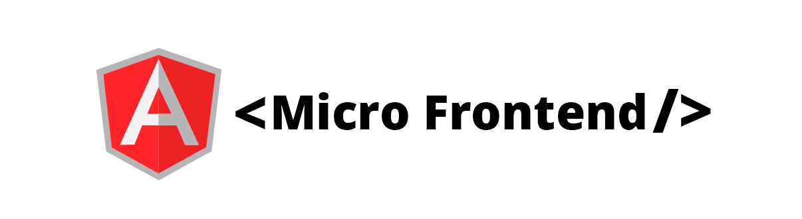
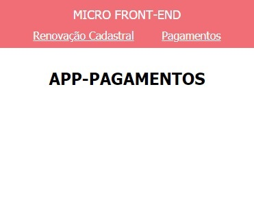

<p align="center">
  
</p>

<p align="center">
  
</p>

## Introdução

Este projeto tem como objetivo ensinar como implementar **Micro Frontend** no Angular.

Ferramentas necessárias para subir o projeto:

- Angular v11.2.4
- Node

## Início rápido

```bash
git clone https://github.com/heliogsantos/micro-frontends.git

🚪 cd app-root

  ⌨️ npm install

🚪 cd app-pagamentos

  ⌨️ npm install

🚪 cd app-renovacao-cadastral

  ⌨️ npm install
```

## Detalhes dos Micro Frontends

Temos dois Micro Frontends **(app-pagamentos, app-renovacao-cadastral)**

- O **app-root**, é o app hospedeiro. Ele vai receber todos os Micro Frontends. 👨‍💻 Angular JS

- O micro front-end **app-pagamentos**, é o aplicativo de pagamentos. 👨‍💻 Angular

- O micro front-end **app-renovacao-cadastral**, é o aplicativo de renovações cadastrais. 👨‍💻 Angular

## Vamos executar a nossa aplicação

com todos os apps instalados e completos para execução,
vamos entrar no app hospedeiro e executar o seguinte comando.

```bash

🚪 cd app-root

  npm start
```

👌 pronto! Nosso app está rodando na porta: http://localhost:3000

Vamos subir os dois Micro Frontends agora. Para isso, entre nos diretórios abaixo e
execute os seguintes comandos:

```bash

🚪 cd app-pagamentos

  npm start

🚪 cd app-renovacao-cadastral

  npm start
```

👌 Legal! Nosso micro front-end **app-pagamentos** está rodando na porta: http://localhost:5001

👌 Legal! Nosso micro frontend **app-renovacao-cadastral** está rodando na porta: http://localhost:5002

😁 Pronto! Nossos apps estão todos rodando em seus devidos lugares. Com isso, podemos notar todos os
apps Angular juntos na mesma aplicação.

## 🔥 Agora vamos entender como tudo isso foi feito em nossa aplicação

ℹ️ Dependências:

Primeiro, em todos os Micros Frontends **(app-pagamentos, app-renovacao-cadastral)**, instalamos o
Angular elements e o ngx-build-plus.

```bash
  npm i --save @Angular/elements

  npm i @Angular/elements ngx-build-plus -D
```

- O Angular elements, da suporte a elementos personalizados (também chamados de componentes da Web)

- O ngx-build-plus é uma ferramenta de compilação alternativa para o Angular

Fizemos algumas alterações no package.json dos Micro Frontends **(app-pagamentos, app-renovacao-cadastral)**
para criar nossos Micro Frontends e servi-lo como elementos personalizados:

ℹ️ package.json:

app-pagamentos

```javascript
 "start": "npm run build && http-server dist/app-pagamentos -p 5001",
  "build": "ng build --prod --output-hashing none --single-bundle true",
```

app-renovacao-cadastral

```javascript
  "start": "npm run build && http-server dist/app-renovacao-cadastral -p 5002",
  "build": "ng build --prod --output-hashing none --single-bundle true",
```

Em nosso app.module.ts dos Micro Frontends **(app-pagamentos, app-renovacao-cadastral)** precisamos definir os
elementos personalizados

app-pagamentos

```javascript
constructor(private injector: Injector) {}

ngDoBootstrap(): void {
  const { injector } = this
  const element = createCustomElement(AppComponent, { injector })
  customElements.define('app-pagamentos', element)
}
```

app-renovacao-cadastral

```javascript
constructor(private injector: Injector) {}

ngDoBootstrap(): void {
  const { injector } = this
  const element = createCustomElement(AppComponent, { injector })
  customElements.define('app-renovacao-cadastral', element)
}
```

O bootstrap do Angular devemos remover e criá-lo na mão,

```javascript
bootstrap: [],
```

Agora precisamos indicar ao Angular que devemos utilizar a ferramenta que instalamos **ngx-build-plus**.

Vamos especificar em três locais dentro do **angular.json** de todos os **Micros Front-Ends**

No **angular.json:**

```javascript
"architect": {
  "build": {
   "builder": "ngx-build-plus:browser",
     ....
  "serve": {
    "construtor": "ngx-build-plus: dev-server",
     ...
  "test": {
    "builder": "ngx-build-plus: karma",
```

😁 Pronto! Nossos micros front-Ends **(app-pagamentos, app-renovacao-cadastral)** estão configurados e
rodadando em suas devidas portas.

<p align="left">
  
</p>

### 🔥 Agora vamos configurar o nosso app hospedeiro **(app-root)**

Como é um app apenas com Angular JS, podemos criar os scripts para adicionar ao body da nossa aplicação.

Esses scripts são de cada Micro Front-End que está rodando em suas portas/domínios

```javascript
  const scriptAppPagamentos = document.createElement('script');

  scriptAppPagamentos.src = 'http://localhost:5001/main.js';

  const scriptAppRenovacaoCadastral = document.createElement('script');

  scriptAppRenovacaoCadastral.src = 'http://localhost:5002/main.js';

  document.body.appendChild(scriptAppPagamentos);
  document.body.appendChild(scriptAppRenovacaoCadastral);
}
```

E para finalizar, agora só temos que indicar ao app hospedeiro que devemos que chamar as tags dos Micros Front-Ends que injetamos via scripts.

Para isso, criei dentro da minha estrutrura do **(app-root)** 2 páginas (app-pagamentos.html e app-renovacao-cadastral.html).

Vamos adicionar as tags dos Micros Front-Ends em cada uma.

Dentro da página 📄 **app-pagamentos.html** adicione:

```html
<app-pagamentos></app-pagamentos>
```

Dentro da página 📄 **app-renovacao-cadastral.html** adicione:

```html
<app-renovacao-cadastral></app-renovacao-cadastral>
```

👍 Pronto! Com isso, já podemos navegar em cada Micro Front-End.

```javascript
-- Angular JS -> Hospedeiro
  -- Angular -> Micro-Front-End
  -- Angular -> Micro-Front-End
```

<p align="left">
  
</p>

😁 Legal! Toda nossa aplicação está pronta.

Para mais detalhes sobre Micro Front-End, segue alguns links.

Blog [martinfowler](https://martinfowler.com/articles/micro-frontends.html)

MICRO-APP EM ANGULAR USANDO WEB COMPONENTS [Danilo Rodrigues](https://youtu.be/54wcutNmsd0)

# 🤗 Obrigado por ter chegado até o final.
